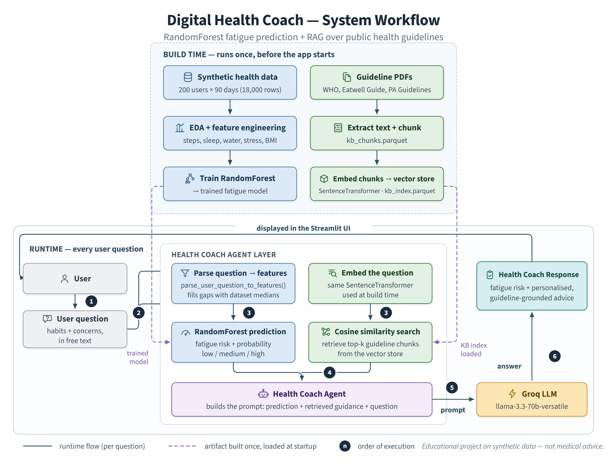

# 🩺 Digital Health Coach — Intelligent Health Chatbot

A hybrid health coaching assistant that predicts a user's **fatigue risk**
from their daily habits using a Random Forest classifier, then answers
their questions with guidance grounded in **WHO and national public health
guidelines** through retrieval-augmented generation (RAG).

Built as a third-year data science project combining classical machine
learning, vector search, and a large language model in a single Streamlit
application.

---

## 📹 Demo

<!--
Record 60-90 seconds showing: the app loading, entering habits in free
text, the fatigue prediction appearing, and the coach's grounded answer.

Then edit this README on github.com and DRAG the .mp4 into the editor.
GitHub uploads it and inserts a user-attachments link that plays inline.
Committing an .mp4 into the repo does NOT work - it renders as a
download link, not a player.

Limit: 10MB on free accounts. If yours is bigger, either compress it or
upload to YouTube as Unlisted and use:
[](https://youtu.be/VIDEO_ID)
-->

*Demo video goes here.*

---

## 🎯 Overview

Most health apps either predict something or explain something. This one
does both, and connects the two: the prediction tells the LLM *what the
user's situation is*, and retrieval tells it *what established guidelines
say about that situation*. The LLM's job is only to phrase the answer, not
to invent the substance of it.

**Features**

- Free-text input — users describe their habits naturally rather than
  filling in a form
- Automatic feature extraction from that text, with dataset medians
  filling any values the user didn't mention
- Fatigue risk prediction from 8 behavioural and physiological features
- Retrieval over chunked public health guidelines, so advice traces back
  to a real source rather than model memory
- Rule-based lifestyle recommendations layered on top of the prediction
- Answers generated by Llama 3.3 70B via the Groq API

---

## 🏗️ Architecture



The system runs on two distinct timelines, which is the key thing to
understand about it:

**Build time (once, ahead of the app)**
1. The synthetic health dataset goes through EDA and feature engineering
2. A Random Forest classifier is trained on it and saved
3. Guideline PDFs are extracted to text and split into chunks
4. Chunks are embedded with SentenceTransformer and stored as a vector index

**Runtime (every question)**
1. The user describes their habits and asks a question
2. The text is parsed into the 8 model features
3. The Random Forest predicts fatigue risk and probability
4. The question is embedded and matched against the vector index by cosine
   similarity, returning the top-k relevant guideline chunks
5. Prediction and retrieved chunks are combined into a single prompt
6. The Groq LLM generates a coaching response, displayed in Streamlit

---

## 📁 Project Structure

```
digital-health-coach/
├── app.py                       # Streamlit UI
├── config.py                    # paths, model names, environment variables
├── src/
│   ├── retrieval.py             # embedding model, KB loading, cosine search
│   ├── models.py                # Random Forest training and prediction
│   ├── parsing.py               # free text → model features
│   └── agent.py                 # prompt assembly and LLM orchestration
├── prompts/
│   └── health_coach.txt         # system prompt
├── data/
│   └── health_synthetic_200users_90days.csv
├── kb/
│   ├── raw/                     # source PDFs (not committed — see kb/raw/README.md)
│   ├── interim/                 # extracted plain text
│   └── processed/
│       ├── kb_chunks.parquet
│       └── kb_index.parquet     # embedded vector index
├── notebooks/
│   └── Notebook.ipynb           # EDA and model development
├── assets/
│   └── health-coach-workflow.png
├── docs/
│   └── Report.docx
├── .env.example
├── .gitignore
├── requirements.txt
└── README.md
```

**Design rule:** nothing under `src/` imports Streamlit. Those modules are
pure Python, callable from a notebook, a test, or a future API. Streamlit's
caching decorators live in `app.py` and wrap the pure functions.

---

## 🧠 The Model

| | |
| --- | --- |
| Algorithm | RandomForestClassifier (scikit-learn) |
| Target | Fatigue risk |
| Training data | 200 synthetic users × 90 days = 18,000 rows |
| Features | `avg_steps_7d`, `avg_sleep_7d`, `avg_stress_7d`, `water_glasses`, `calories_intake`, `resting_heart_rate`, `age`, `bmi` |

The rolling 7-day averages matter here — fatigue is a pattern over time,
not a property of a single day, so the features are engineered to reflect
recent habits rather than yesterday's numbers.

**On the synthetic data:** the dataset is generated, not observed. That
makes it suitable for demonstrating the pipeline but means the model's
accuracy figures describe how well it learned the generator's rules, not
how well it would predict fatigue in real people.

---

## 📚 Knowledge Base

| Source | Publisher |
| --- | --- |
| Healthy diet fact sheet | World Health Organization |
| Physical activity fact sheet | World Health Organization |
| The Eatwell Guide | Public Health England |
| Physical Activity Guidelines for Americans (2nd ed.) | US Dept. of Health & Human Services |

Documents are chunked, embedded with SentenceTransformer, and retrieved by
cosine similarity. The source PDFs are not committed to keep the repository
small — see `kb/raw/README.md` for download links. The pre-built vector
index **is** committed, so the app runs without re-running the embedding step.

---

## ⚙️ Setup

### 1. Environment

```bash
python -m venv venv
venv\Scripts\activate          # Windows
# source venv/bin/activate     # macOS / Linux

pip install -r requirements.txt
```

### 2. Groq API key

Get a free key at [console.groq.com](https://console.groq.com), then copy
the template and paste it in:

```bash
copy .env.example .env         # Windows
# cp .env.example .env         # macOS / Linux
```

```
GROQ_API_KEY=your_key_here
```

`.env` is git-ignored. Never commit a real key — GitHub is scanned by bots
and an exposed key is usually abused within minutes.

### 3. Run

```bash
streamlit run app.py
```

Opens at `http://localhost:8501`.

---

## 💬 Example

> "I've been sleeping about 5 hours a night, walking maybe 3000 steps,
> and I'm stressed at work. Why am I so tired?"

The app extracts sleep, steps, and stress from that sentence, fills the
remaining features with dataset medians, predicts a fatigue risk level,
retrieves the relevant WHO sleep and activity guidance, and returns a
response that names the specific habits driving the prediction.

---

## 🛠️ Tech Stack

| Layer | Tool |
| --- | --- |
| Interface | Streamlit |
| ML | scikit-learn (RandomForestClassifier) |
| Embeddings | sentence-transformers |
| Vector search | cosine similarity (scikit-learn) |
| Storage | Parquet via pyarrow |
| LLM | Llama 3.3 70B via Groq (`langchain-groq`) |
| Data | pandas, numpy |

---

## ⚠️ Limitations

- Trained on synthetic data, so the model has not been validated against
  real health outcomes
- Fatigue risk is a coarse signal, not a clinical assessment
- Retrieval quality depends on chunking — a question phrased unlike the
  guideline wording may retrieve weaker matches
- No user accounts, session persistence, or longitudinal tracking
- Guidelines are UK/US/WHO sources and may not reflect local dietary norms

---
